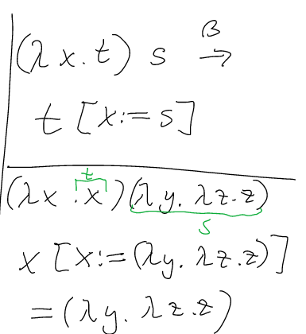
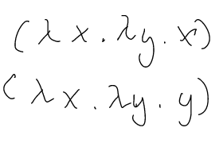

# Week 4 Lecture

Recall: There was no lecture last week!

## TODO

* [ ] Complete the sample midsession exam before Week 5

## Tuesday Lecture

### Substitution

We write:

$$ x \ [x := t'] $$

to denote a $$$ t $$$ where all free occurences of $$$ x $$$ is replaced by $$$ t' $$$.

* Do not sub with expressions that have already bound variables in them

#### Examples

$$ x[x:=y] = y $$
$$ z[x:=y] = z, if z \ne x $$
$$ (Op t_1 .. t_n) [x := y] = Op (t_1 [x := y]) .. Op (t_2 [x := y]) $$

### Untyped $$$ \lambda $$$- Calculus

* Very simple, Turing-complete formalism for computations introduced by Alonzo Church in 1936
* Formalise the notion of computability mathematically
* Turing complete means any kind of computation in the language can be computed by the Turing machine

#### $$$ \lambda $$$ calculus rules

Three main rules:

* $$$ \alpha $$$-conversion
	* if $$$ t \equiv_{a} s $$$ then two terms are equivalent in the calculus
* $$$ \beta $$$-reduction
	* $$$ (\lambda x. t)s$$$ can be reduced to $$$t[x:=s]$$$
* $$$ \eta $$$-conversion
	* $$$ \lambda x \ (f \ x) $$$ is equivalent to $$$ f $$$ if $$$ x $$$ is not free in $$$ f $$$


#### Example of $$$ \beta $$$-reduction



#### Defining true and false in $$$ \lambda $$$ calculus



#### $$$ \lambda $$$ calculus in Haskell examples

* Another name for $$$ \lambda $$$ calculus is a function that doesn't have a name

```
(\ x -> x) 10

(\ x -> \y -> 2* x + y) 10 2
```

