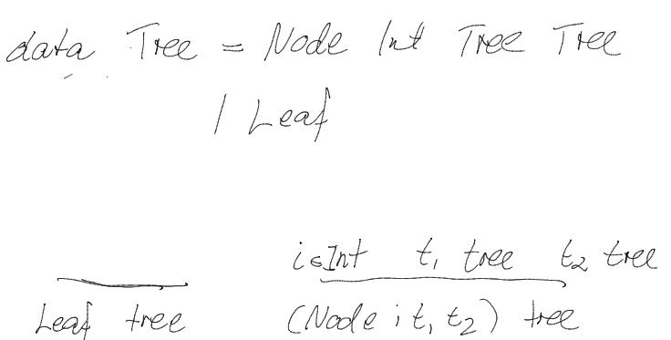
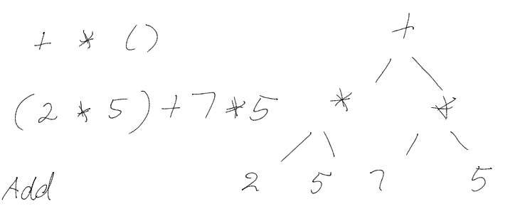
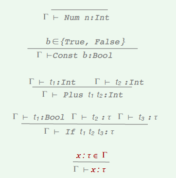
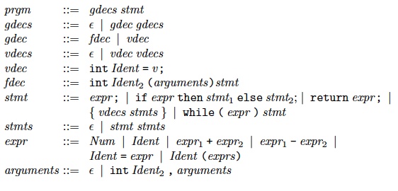

# Week 5 Lecture

## Exam revision

Recall that:

```
data Tree = Node Int Tree Tree
		  | Leaf
```
Recall this is a type in Haskell which defines a set of possible types of a Tree.

The equivalent in a judgement form is:



### Concrete vs Abstract

Recall that concrete is more human readable:

```
+ * ()
(2 * 5) + 7 * 5
```
Abstract is post fix and always rendered the same from concrete (only one representation of the same thing vs multiple representations of the same thing in concrete syntax):

`Add (Mult (Num 2) (Num 5)) (Mult (Num 7) (Num 5))`

This is the tree:




## MinHS

* A stripped down, purely functional language
* No side effects
* Call by value 
* Strongly typed
* Types have to be provided by the programmer - no type inference only type checking

### Type checking

We need typing rules for:

* Constant values
* Variables
* Operators
* Function definitions
* Application




## TinyC

An imperative language with:

* Global function declarations
* Global and local variables
* Assignment
* Iteration: while loops
* Conditional: if statements
* Only a single value type: int

The program basically consists of one statement and a series of global declarations which can be function declarations or variable declarations.

In contrast to C we always need to initialise a variable as soon as we declare it

### EBNF



### Static Semantics

We have to check:

* Vars and functions are in scope when they are used
* Functions are called with the correct number of args
* There is a return statement in ever possible control flow in a function block
* Else if there is no explicit return statement set the return value to be default the last one evaluated 

We use:

* Environment of vars: {$$$x_1, x_2, ...$$$}
* Environment of functions with how many arguments they need (arity): {$$$f_1: n_1, f_2: n_2, ...$$$}

#### Language components

Two kinds:

* Expressions and statements
* Declarations

#### Judgements

* Well formed expressions and statements (given a var environment V and function environment F):
