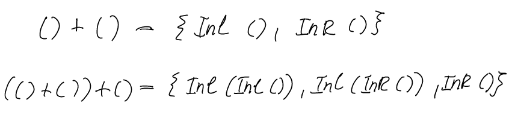
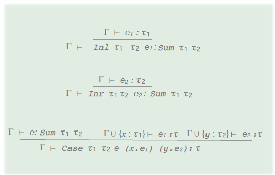

# Week 7 Lecture

## Sum-types

* Union types / composite types
* Alternatives differ only in name (enums)

`data Colour = Red | Green | Blue `

* Case distinction by pattern matching

What MinHS type corresponds to the above Haskell type?



### Static Semantics: Typing rules



Note on Inl typing rule: 

`Inl (1 + 3) :: Int + Bool`

So all we know from Inl is that it returns the  type of the left term

#### Haskell example

```
import Prelude hiding (Either)
data Either a b = InL a | InR b

foo :: Either Int Bool
foo = InL 6
```

### Dynamic Semantics: Typing rules


## Parametric polymorphism in MinHs

* In Haskell when two vars are swapped it doesn't matter what type they are as it will always be  swapping pointers so it doesn't care what type they are

* In MinHS no type inference so we must instantiate each polymorphic function with it's type vars 
* 


