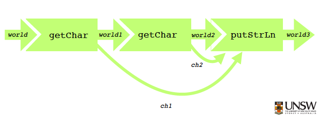

# Week 9 Lecture - Overloading and IO

## Type classes

* Type classes are sets of types
* Types are sets of values

### Examples

* Int, Float, Double are in the type class Num
* Class methods of Num are arithmetic ops

### Notation 

* Num t means type t is in the type class Num 


### Type inference

* To determine which types are in which type classes we use a predicate set P 
* P = {Num Int, ..., Eq Bool, Eq Int, ..}

### Subtypes

* A is a subtype of B if whenever I need a B I can use an A

## IO

### Pure functions 
* The output of a pure function only depends on its argument, not on a global state
* Evaluating a function does not affect a global state

### IO functions
* Conceptually IO functions are pure functions 
	* The world is part of the input
	* A new world it part of the output

* In the following diagram world is threaded through multiple computations:




### Haskell do notation

```
foo = do
  c1 <- getChar :: IO Char
  c2 <- getChar :: IO Char
  let resultString = [c1] ++ [c2] :: String
  str <- return ([c1] ++ [c2]) :: IO a
  putStrLn resultString IO ()
```

### Why bother using IO Monad?

* Control side effects
* Checked by the compiler, simplifies debugging
* Evaluation order is unambiguous (especially important for concurrency)

### Maybe type
* Maybe type constructor is a monad

```
addMaybe :: Maybe Int -> Maybe Int -> Maybe Int
add Maybe m1 m2 = do
	x1 <- m1
	x2 <- m2
	return (x1 + x2)
	
-- Calling it:
addMaybe (Just 1) (Just 2) :: Just 3
```


