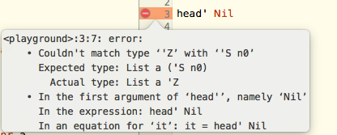

# Week 11

## Existentially Quantified Data Types and Abstraction

Polymorphic data types:

`data Maybe a = Just a | Nothing`

GADT equivalent:

```
data Maybe a where
	Just :: a -> Maybe a
	Nothing :: Maybe a 
```

The difference is that in the GADT we can specify the type of Nothing to be `Maybe Int` for example

The more restrictive the type the more we know about the type

Example:

```
data Foo where
	MkFoo :: a -> Foo
```

What can we do with an object of type Foo?

```
doSomething :: Foo -> a
doSomething (MkFoo x) = x 
```

* We don't know what type x is!
* So writing `Foo -> a` is telling the compiler that given a Foo object it can return any type `a`
* Hence the definition of `Foo` loses the type information of `a`
* A rigid type variable is an existentially qualified type
* The real type of the method `doSomething` is therefore not quantified by forall but rather there exists i.e. `doSomething :: \exists{a} Foo -> a`

### Quantifier predicate logic rules


Hence to fix it we simply change the type signature of `MkFoo`

```
data Foo where
	MkFoo :: a -> (a -> String) -> Foo

doSomething :: Foo -> String
doSomething (MkFoo x fn) = fn x
```

Example usage:

`xs = [MkFoo 5 show, MkFoo even (\_ -> "even")]`

mapping

`map doSomething xs`

Alternatively we can use typeclasses to avoid even having to explicitly type `a` as a string by making sure a is an element of typeclass `Show`:

```
data Fum where
	MkFum :: forall a. Show a => a -> Fum 

doSomething :: Fum -> String
doSomething (MkFum x) = show a 
```

### Implementing a stack ADT 

Using existentially quantified types! 

#### Concrete implementation 

```
emptyS :: Stack
popS :: Stack -> int
pushS :: Stack -> Int -> Stack
top :: Stack -> Int
```

#### Abstraction

Define the concrete stack implementation:

```
Rec IntList. (() + (Int, IntList))
emptyS =
Roll (InL ())
letfun pushS st item =
Roll (InR (st, item))
```

Then bundle all the functions of the ADT into `Pack`

```
Pack (Rec IntList. (() + (Int, IntList)),
Roll (InL ()),
letfun pushS st item = ....,
letfun popS ...
)
```

Hence only the function types will be visible:

```
∃S. (S, S -> Int -> S, S -> S, S -> Int)
```

To make the operations of the ADT available using `Open (e, t.x::σ.e’)`

Concrete example of `open`


#### Code example 


* We encode information of what the type contains using type parametricisation
* A type is a theorem e.g. `a -> (a + b)` is a type that encodes the theorem that a implies a or b


* Z is a singleton type and so is Zero


* 'head and 'tail are total functions so if you pass in an empty list it will generate a type error at compile time as opposed to run time error

e.g.



* hence encoding information into types reduces the occurrence of runtime errors 


