# Week 8 Lecture - Type Inference

## Principal type

We write τ’≤ τ if τ’ is less general than τ, that is τ’ is an instance of τ

### Examples

* Int * Int ➔ Int ≤ ∀ a. Int* a ➔ Int 
* ∀ a. Int* a ➔ Int ≤ ∀ a. ∀ b. b* a ➔ b

But be careful this is not an instance!

∀ a. Int * a ➔ Int ≤ ∀ a. ∀ a. a * a ➔ a

τ says that both params have to be the same while τ’ says that the second parameter can be difference


### Goal

We are interested in finding the most general type τ of the expression e such that e: τ’ implies τ’ ≤ τ 


## Implicitly typed MinHs

MinHs with the following changes:

* Throw away all the type annotations for functions and type constructors (sum & product types)
* Throw away `roll`, `unroll`, `rec`
* No more explicit type abstraction and instantiation e.g. `Type` and `inst` removed
* Types of the build in functions are part of the environment 
* e.g. `fst` `+`

```
Γ = {+: Int ➔ Int ➔ Int, fst: ∀ a. ∀ b.(a * b) ➔ a , ....}
```

* no overloading yet! e.g. == only compares ints 

### Typing rules

* Application, if-expression, variable and product rules stay the same

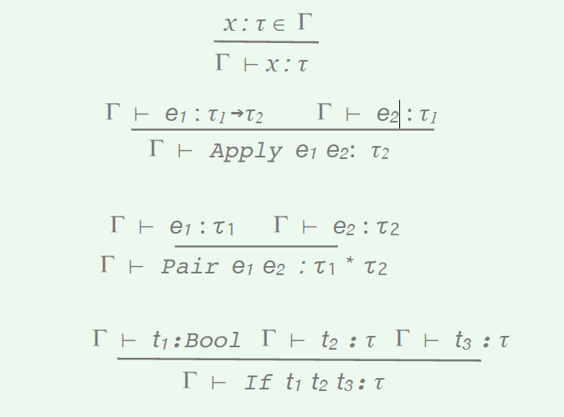

* Typing rule for functions is also the same

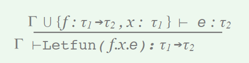

*  In the original MinHs we had to keep track of what the possible types of t2 is. Inlr and Inl here is a bit a bit different since they introduce `free type variables`:

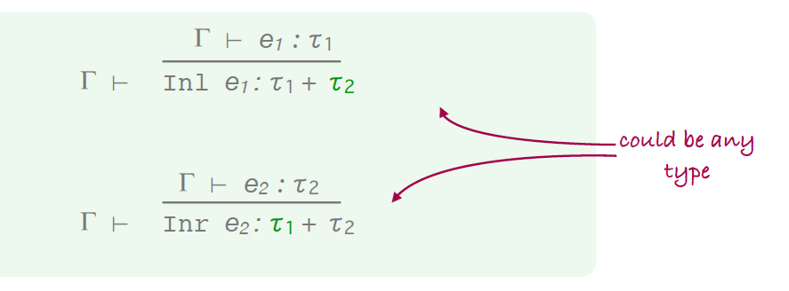

* This means we evaluate the type of e1 to be t1 and then just pick any type you like for t2 

* Instead of the `Inst` and `Type` rules we have 2 new rules - ∀-introduction and eliminaton:

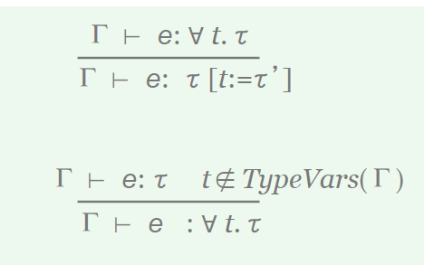


* The first rule says that we can derive that e has the type ∀ t. τ

* e.g. if e is fst than we know that it's type is ∀ a. ∀ b.(a * b) ➔ a
then you can replace the forall type quantifier variables a and b with anything you like

* So we can get rid of the forall quantifier using the first rule by replacing t with any type we want

* We can introduce a forall quantifier by selecting a t which for whatever reason isn't currently part of the type variables in the environment, and introduce a forall with that t
 
#### Examples

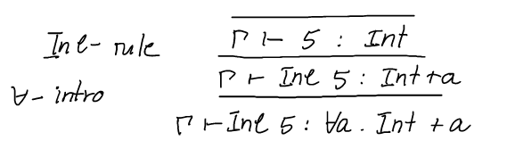

The reason why this is done in 2 steps instead of just including the forall quantifier in the rules for inferring the type of t2 in `Inl` and `Inr` is because it's more versatile and we can combine the forall introduction and elimination rules with any rules we want

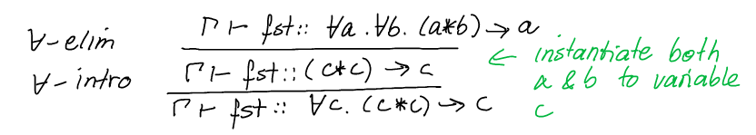

* for all introduction rule can always be applied
e.g. if we have a type Int then we can always add `forall a. Int` - this might not be very useful but we can always do it

* rules describe relations between multiple things 

* to implement a type inference algorithm using these typing rules we view the environment and the expression as the input and the type as the output 

First attempt to derive the type of `fst` which is not obvious - this shows the problem of guessing a type when we don't know:

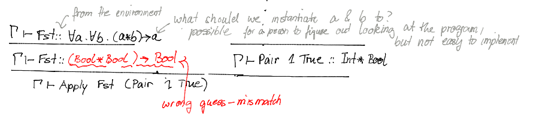

Hence rules don't really specify an algorithm that we can easily implement

A better solution is to replace quantified variables with fresh (may not be used elsewhere) variables - we delay instantiation until we know more

This is the strategy:

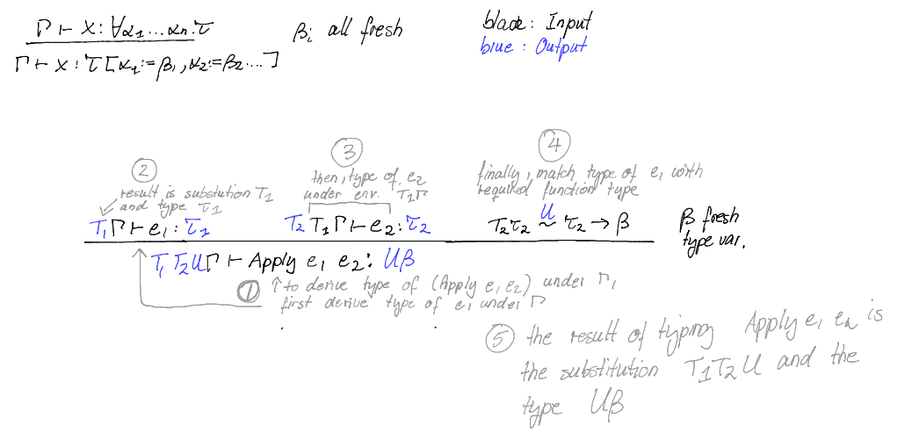

So attempting to derive the above problem again:

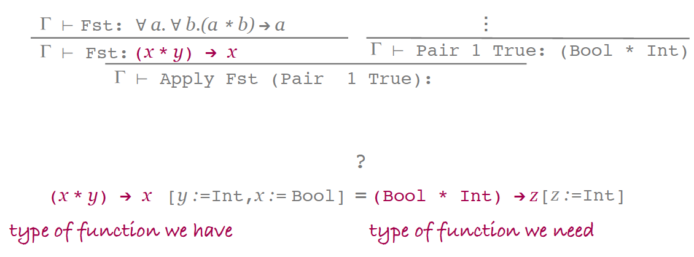

* We can unify these two type terms by using substitution  

More examples:

* (Bool * x) and (y * Int)

* In this case the substitution to unify them would be [y := Bool, x := Int]

However the goal here is to find a substitution that is more general, not one that is too specific like this one:

* (x * x) and (x * y)
* Unify them with [x := Int, y := Int]
* However the problem is this is too specific! We want to find a more general unifier 

### Unification

So we want to find a substitution S where 

```
S τ = S τ’
```

S is called a unifier of τ and τ'

We write that 

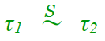

if S is the most general unifier (mgu) of τ1 and τ2


### Type inference algorithm

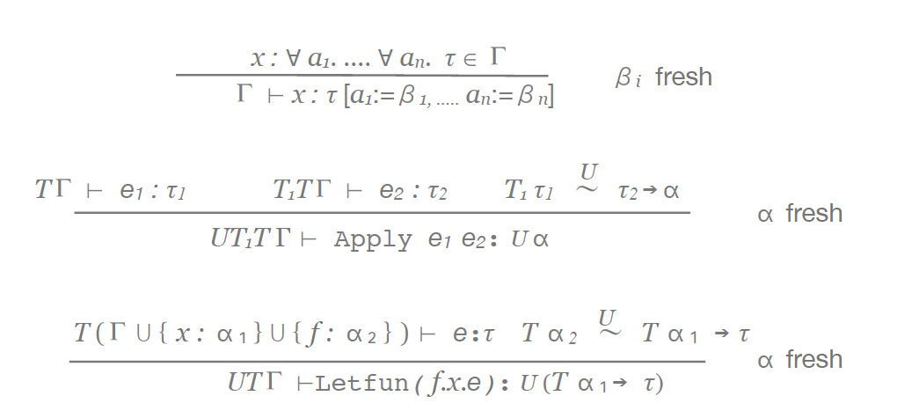

* these rules are syntax directed
* the environment and expression are input and unifier and type are output  


